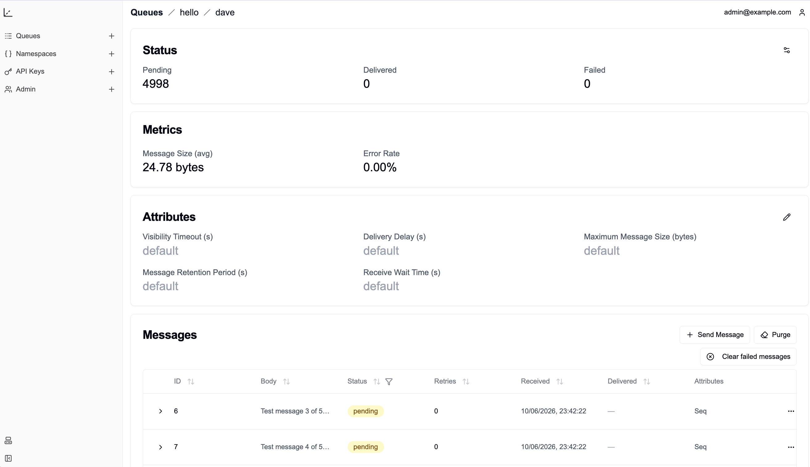

<div align="center">
  <span>
    <h1>NerveMQ</h1>

[](https://github.com/mshunshin/nervemq/blob/main/LICENSE)

  </span>

A lightweight, SQLite-backed message queue with AWS SQS-compatible API and web interface, written in Rust.

</div>



> This project is still in development and has not been tested in production scenarios.
> It has been forked from [fortress-build/nervemq](https://github.com/fortress-build/nervemq/) by [mshunshin](https://github.com/mshunshin/nervemq).

## Features

- 🚀 **AWS SQS Compatible API** - Drop-in replacement for applications using AWS SQS
- 💾 **SQLite Backend** - Reliable, embedded storage with ACID guarantees
- 🔒 **Multi-tenant** - Namespace isolation with built-in authentication
- 📊 **Queue Attributes** - Track message counts, timestamps, and queue settings
- 🏃 **Fast & Efficient** - Written in Rust for optimal performance
- 🎯 **Self-contained** - Self-contained binary with minimal requirements
- 📱 Admin Interface - Manage queues and tenants via UI or API

## Installation / Quick Start

NerveMQ is intended to be modular and extensible. As such, it can be consumed in two ways: using
the preconfigured binary in `main.rs`, or including `nervemq` as a library and providing the custom
implementations needed for your use-case. We also plan to add more configuration options to the preconfigured
binary so that common use-cases are covered.

For now, you will have to clone the repo from github.

```bash
git clone https://github.com/mshunshin/nervemq
cd nervemq
cargo run --release
```

The server expects a few configuration parameters to be available via
environment variables:

- `NERVEMQ_DB_PATH` (optional; default: `./nervemq.db`)
  Database file path. The `--data-dir` command-line flag is a convenient
  alternative when you only want to choose a directory: `nervemq --data-dir
  /var/lib/nervemq` writes both `nervemq.db` and `sessions.db` there, creating
  the directory if needed. `--data-dir` takes precedence over `NERVEMQ_DB_PATH`.

- `NERVEMQ_SESSIONS_DB_PATH` (optional; default: `sessions.db` next to the
  main database file)
  Admin sessions live in their own SQLite database so per-request session
  writes never compete with message traffic for the main database's write
  lock (see [docs/architecture/sessions.md](docs/architecture/sessions.md)).
  Created automatically; safe to delete when the server is stopped — doing
  so just logs every admin out.

- `NERVEMQ_DEFAULT_MAX_RETRIES` (optional; default: `2`)
  Default delivery-attempt cap per message. Counts every receive, including
  the first delivery — `2` means one initial delivery plus one redelivery,
  after which the message is marked `failed` and no longer delivered (see
  [docs/architecture/message-lifecycle.md](docs/architecture/message-lifecycle.md)).
  Copied into each queue's configuration at creation time and adjustable
  per queue afterwards.

- `NERVEMQ_HOST` (optional; default `http://localhost:8080`)
  Server host URL (for UI access)

- `NERVEMQ_BIND_ADDRESS` (optional; default `127.0.0.1:8080`)
  Socket address the HTTP server listens on. Defaults to loopback so a locally
  run server isn't exposed on the network; set it to `0.0.0.0:8080` to listen
  on all interfaces (the Docker image does this by default).

- `NERVEMQ_ROOT_EMAIL` (optional; default `admin@example.com`)
  Root admin email. The root account is created on first start. (Changing the
  email afterwards creates a separate admin rather than renaming the existing
  one.)

- `NERVEMQ_ROOT_PASSWORD` (optional; default `password` on first start only)
  Root admin password. On first start the root account is created with this
  value (or `password` if unset). On later starts: if the variable is **set**,
  its value is re-applied — overwriting the stored password so it stays
  authoritative even against an existing database; if it is **unset**, the
  stored password is left unchanged, so a password changed via the UI / API /
  `nervemq user passwd` survives restarts.

- `NERVEMQ_LOG` (optional; default `info`)
  Log filter (a [tracing `EnvFilter`](https://docs.rs/tracing-subscriber/latest/tracing_subscriber/filter/struct.EnvFilter.html)
  directive, e.g. `warn` or `nervemq=debug`). Per-request log and span
  machinery costs a few percent of single-message throughput: benchmarked
  on the SQS paths, `NERVEMQ_LOG=warn` gains ~2–3% on sequential sends and
  round trips over the default `info`.

Running `nervemq` with no arguments starts the server; admin subcommands are
described under [Admin CLI](#admin-cli).

### Bundled UI (single binary)

The admin UI is compiled into the server binary by default (the `embed-ui`
feature) and served from the same port as the API. Build the static export
first, then build the server:

```bash
git clone https://github.com/fortress-build/nervemq
cd nervemq

# 1. Build the Next.js static export into ./out
bun install
bun run build

# 2. Build the server with the UI embedded
cargo build --release
```

The resulting binary serves the API and the UI together on
`http://localhost:8080`.

The build fails with a clear error if `out/` is
missing; for an API-only server that doesn't require `out/`, build with
`cargo build --release --no-default-features`.

Of course, it will happily build with an outdated bundle if you have forgotten to rebuild it.

### Docker

A multi-stage [`Dockerfile`](Dockerfile) builds the UI and the server into a
single image (UI embedded). Pushing a `v*` tag publishes a multi-arch
(`linux/amd64` + `linux/arm64`) image to the GitHub Container Registry via
[`.github/workflows/release.yml`](.github/workflows/release.yml):

```bash
git tag v0.2.0
git push origin v0.2.0
# -> ghcr.io/mshunshin/nervemq:0.2.0 (and :0.2, :0, :latest)
```

Run it, persisting the SQLite databases to a named volume:

```bash
docker run -p 8080:8080 -v nervemq-data:/data ghcr.io/mshunshin/nervemq:latest
```

The image listens on all interfaces (`NERVEMQ_BIND_ADDRESS=0.0.0.0:8080`) and
keeps its databases in `/data` (via `--data-dir`). Override any of the
`NERVEMQ_*` settings with `-e`, e.g. `-e NERVEMQ_ROOT_PASSWORD=…`. To build the
image locally:

```bash
docker build -t nervemq .
```

### Developing the UI standalone

To iterate on the UI with hot reload, run the Next.js dev server (it points at a
separately running backend on port 8080 via `NEXT_PUBLIC_SERVER_ENDPOINT`):

```bash
cargo run            # API server on :8080
bun run dev          # UI dev server on :3000
```

## Admin CLI

Running `nervemq` with no arguments starts the server. Subcommands perform
one-off admin operations against the configured database
(`NERVEMQ_DB_PATH`, same environment variables as the server) and exit.
The global `--data-dir` flag works here too (e.g. `nervemq --data-dir
/var/lib/nervemq user list`), so the CLI operates on the same database the
server does. SQLite's WAL mode makes it safe to run them while the server is up.

```bash
# Namespaces
nervemq namespace add demo
nervemq namespace list
nervemq namespace remove demo

# Users (password prompted interactively if --password is omitted)
nervemq user add alice@example.com --role admin
nervemq user add bob@example.com --namespace demo --namespace staging
nervemq user list
nervemq user passwd bob@example.com               # change a user's password
nervemq user remove bob@example.com

# API keys for the SQS-compatible API (secret is printed once at creation).
# --user defaults to the root administrator.
nervemq apikey add --name ci-key --namespace demo
nervemq apikey add --name bob-key --namespace demo --user bob@example.com
nervemq apikey list
nervemq apikey remove --name ci-key
```

## Usage Examples

NerveMQ's queue APIs are compatible with SQS, so you can you any SQS client.

### Using AWS SDK

```rust
use aws_sdk_sqs::{Client, Config};

async fn example() {
    let config = Config::builder()
        .endpoint_url("http://localhost:8080/api/sqs")
        .build();

    let client = Client::from_conf(config);

    // Send a message
    client.send_message()
        .queue_url("http://localhost:8080/api/sqs/namespace/myqueue")
        .message_body("Hello World!")
        .send()
        .await?;
}
```

## HTTP API Reference

NerveMQ exposes two HTTP surfaces on the same port (default `http://localhost:8080`):

- A **management API** under `/api/admin` used by the admin UI, for controlling
  queues, namespaces, users and API keys.
- An **SQS-compatible API** under `/api/sqs` for sending and receiving messages.

### Authentication

| Surface | Mechanism |
| --- | --- |
| Management API (`/api/admin/*`) | Session cookie `nervemq_session`, obtained via `POST /api/admin/auth/login`. |
| SQS API (`/api/sqs`) | AWS Signature V4, signed with an API key's `access_key`/`secret_key` (created via `POST /api/admin/tokens`). |

Access levels per scope:

- `/api/admin/auth` — public.
- `/api/admin/queue`, `/api/admin/stats`, `/api/admin/tokens` — any authenticated user.
- `/api/sqs` — authenticated (SigV4); namespace access is additionally checked per request.
- `/api/admin/ns`, `/api/admin/users` — admin role only.

Sessions expire after 1 hour. The default root account is configured via
`NERVEMQ_ROOT_EMAIL` / `NERVEMQ_ROOT_PASSWORD`.

### Auth — `/api/admin/auth` (public)

| Method | Path | Body | Description |
| --- | --- | --- | --- |
| POST | `/api/admin/auth/login` | `{ "email", "password" }` | Logs in and sets the session cookie. Returns `{ "email", "role" }`. |
| POST | `/api/admin/auth/logout` | — | Clears the session. |
| POST | `/api/admin/auth/verify` | — | Returns the current session's `{ "email", "role" }`, or `401` if not logged in. |

### Queues — `/api/admin/queue` (authenticated)

| Method | Path | Body | Description |
| --- | --- | --- | --- |
| GET | `/api/admin/queue` | — | List all queues the user can access. Returns `{ "queues": [...] }`. |
| GET | `/api/admin/queue/{ns}` | — | List queues in namespace `{ns}`. |
| POST | `/api/admin/queue/{ns}/{queue}` | `{ "attributes": {…}, "tags": {…} }` | Create a queue. |
| DELETE | `/api/admin/queue/{ns}/{queue}` | — | Delete a queue. |
| GET | `/api/admin/queue/{ns}/{queue}` | — | Queue statistics (pending / delivered / failed, sizes, etc.). |
| GET | `/api/admin/queue/{ns}/{queue}/messages` | — | List messages currently in the queue. |
| DELETE | `/api/admin/queue/{ns}/{queue}/messages/failed` | — | Delete every failed (retry-exhausted) message. Returns `{ "deleted": n }`; a queue with none is a no-op. |
| GET | `/api/admin/queue/{ns}/{queue}/config` | — | Get queue config (`max_retries`, `dead_letter_queue`). |
| POST | `/api/admin/queue/{ns}/{queue}/config` | `{ "max_retries": u64, "dead_letter_queue": "name" \| null }` | Update queue config. |

### Statistics — `/api/admin/stats` (authenticated)

| Method | Path | Description |
| --- | --- | --- |
| GET | `/api/admin/stats/queue` | Per-queue statistics across all accessible queues (map keyed by queue). |
| GET | `/api/admin/stats/ns` | Per-namespace statistics. |

### API keys / tokens — `/api/admin/tokens` (authenticated)

| Method | Path | Body | Description |
| --- | --- | --- | --- |
| GET | `/api/admin/tokens` | — | List the caller's API keys (`name`, `namespace`). |
| POST | `/api/admin/tokens` | `{ "name", "namespace" }` | Create an API key. Returns `{ "name", "namespace", "access_key", "secret_key" }` — the `secret_key` is shown only once. |
| DELETE | `/api/admin/tokens` | `{ "name" }` | Delete one of the caller's API keys by name. |

### Namespaces — `/api/admin/ns` (admin only)

| Method | Path | Body | Description |
| --- | --- | --- | --- |
| GET | `/api/admin/ns` | — | List namespaces. |
| POST | `/api/admin/ns/{ns}` | — | Create namespace `{ns}`. Returns `{ "id" }`. |
| DELETE | `/api/admin/ns/{ns}` | — | Delete namespace `{ns}`. |

### Users & permissions — `/api/admin/users` (admin only)

| Method | Path | Body | Description |
| --- | --- | --- | --- |
| GET | `/api/admin/users` | — | List users (`email`, `role`). |
| POST | `/api/admin/users` | `{ "email", "password", "role", "namespaces": [...] }` | Create a user. |
| DELETE | `/api/admin/users` | `{ "email" }` | Delete a user. |
| GET | `/api/admin/users/{email}/permissions` | — | List namespaces the user has access to. |
| PUT | `/api/admin/users/{email}/permissions` | `["ns", …]` | Grant access to the listed namespaces. |
| POST | `/api/admin/users/{email}/permissions` | `["ns", …]` | Replace the user's namespace permissions with the listed set. |
| DELETE | `/api/admin/users/{email}/permissions` | `["ns", …]` | Revoke access to the listed namespaces. |
| GET | `/api/admin/users/{email}/role` | — | Get the user's role. |
| POST | `/api/admin/users/{email}/role` | `{ "role": "user" \| "admin" }` | Set the user's role. |

### SQS-compatible API — `/api/sqs`

All SQS operations are a single `POST /api/sqs` using the AWS JSON protocol: the
operation is selected by the `X-Amz-Target: AmazonSQS.<Operation>` header and the
request/response bodies match the AWS SQS shapes. Queue URLs have the form
`http://<host>/api/sqs/<namespace>/<queue>`. Requests must be signed with SigV4 using
an API key (see `/api/admin/tokens`). Easiest consumed via any standard AWS SQS SDK (see
[Usage Examples](#usage-examples)).

Implemented operations:

`CreateQueue`, `DeleteQueue`, `GetQueueUrl`, `GetQueueAttributes`,
`SetQueueAttributes`, `ListQueues`, `ListQueueTags`, `TagQueue`, `UntagQueue`,
`PurgeQueue`, `SendMessage`, `SendMessageBatch`, `ReceiveMessage`,
`DeleteMessage`, `DeleteMessageBatch`, `ChangeMessageVisibility`,
`ChangeMessageVisibilityBatch`.

Notes:

`ChangeMessageVisibility` follows the AWS semantics:
`VisibilityTimeout` (0–43200 seconds) is counted from the time of the call,
not from when the message was received — `0` releases the message
immediately.

`DeleteMessage`: **NerveMQ-specific:** the AWS specification leaves unspecified whether a
message whose visibility timeout has lapsed can still be deleted by its
original consumer. NerveMQ guarantees that it can so long as it hasn't
been re-delivered: a receipt handle remains
valid for `DeleteMessage` after the window lapses, right up until the
message is delivered to another consumer — only redelivery mints a new
handle and invalidates the old one. A slow consumer that finishes its work
late can therefore still acknowledge the message, as long as nobody else
has received it in the meantime (see
[docs/architecture/message-lifecycle.md](docs/architecture/message-lifecycle.md)).

In the batch variants (`SendMessageBatch`, `DeleteMessageBatch`,
`ChangeMessageVisibilityBatch`), entries succeed or fail independently: the
response correlates per-entry results by the caller-assigned entry id, as on
AWS.

`MessageRetentionPeriod` **NerveMQ-specific:** messages older than the
queue's configured period (in seconds, measured from arrival) are deleted
by a background sweep that runs every 10 minutes, regardless of lifecycle
state — in-flight and failed messages expire too, as on AWS. Unlike AWS
there is **no default retention**: a queue with the attribute unset — or
explicitly set to `0` — keeps messages forever, and the AWS 60 s–14 day
bounds are not enforced.

> [!NOTE]
> Other SQS operations (e.g. `AddPermission`, the message-move-task family)
> are not yet supported.


> [!NOTE]
> Currently the dead-letter queue is onlly partially implemented and not at all tested.
> It also differs in its implementation to how SQS works.
> Practically, don't use it unless you plan on reviewing and tweaking it.
> See [docs/architecture/dead-letter-queues.md](docs/architecture/dead-letter-queues.md)
> for exactly what is and isn't implemented and how it differs from AWS.

## Changes in this fork

This repository (`mshunshin/nervemq`) has diverged substantially from the
upstream `fortress-build/nervemq` it was forked from. At the fork point the
project was effectively a send-only prototype; the work since has made it a
complete, AWS-compatible queue with a performance and completeness that exceeds
the two alternative SQS replacements: [smoothmq](https://github.com/poundifdef/smoothmq),
and [ElasticMQ](https://github.com/softwaremill/elasticmq).

### Functionality

- **The consume side of the queue.** At the fork, `ReceiveMessage` never
  returned a receipt handle, so messages could not be acknowledged at all.
  The full lifecycle now works and is documented in
  [docs/architecture/message-lifecycle.md](docs/architecture/message-lifecycle.md):
  per-delivery receipt handles, visibility timeouts (request, queue
  attribute and `ChangeMessageVisibility`, which was unimplemented), retry
  exhaustion into a `failed` state, and the NerveMQ-specific guarantee that
  a lapsed handle still acknowledges until redelivery.
- **New operations**: `DeleteMessageBatch` and `ChangeMessageVisibilityBatch`
  (per-entry results, set-based internally); message system attributes
  (`SentTimestamp`, `ApproximateReceiveCount`,
  `ApproximateFirstReceiveTimestamp`, `SenderId`);
  `MessageRetentionPeriod` enforcement (`0`/unset = retain forever).
- **Wire-format compatibility** fixes found by driving the API through the
  real AWS SDKs: request bodies over 8 KiB were unparseable (batch sends
  could never work), `SendMessageBatch` swapped the namespace and queue URL
  segments, messages without `MessageAttributes` were rejected, empty
  attribute maps are now omitted as AWS does, create-time queue attributes
  and tags are honored, and numeric-looking names/values survive storage.
- **Admin improvements**: management CLI (`nervemq user|namespace|apikey`),
  paginated and sortable message lists with received/delivered timestamps,
  one-click clearing of failed messages, message requeue/mark-failed, and
  server-side session expiry with garbage collection (sessions previously
  accumulated forever).

### Performance

Measured with [examples/python/benchmark.py](examples/python/benchmark.py)
(release builds, 1 KiB payloads, medians of 3 interleaved runs on the same
machine) against the fork point — where only two of the six scenarios could
run at all:

| Scenario | At the fork | This fork | Change |
| --- | --- | --- | --- |
| `send_message` (sequential) | 1,364 msg/s (p50 0.69 ms) | 2,163 msg/s (p50 0.45 ms) | **+59%** |
| `send_message` (8 threads) | 1,878 msg/s (p99 37–40 ms) | 2,454 msg/s (p99 11–16 ms) | **+31%**, ~3× tighter tails |
| `send_message_batch` (10/req) | broken | 14,648 msg/s | — |
| receive + delete drain | impossible (no receipt handles) | 1,824 msg/s | — |
| receive + batch-delete drain | impossible | 8,304 msg/s | — |
| send → receive → delete | impossible | 725 msg/s | — |

The structural changes behind the numbers: header-authenticated SQS
requests no longer create sessions (previously two to three database
writes of pure overhead per request), SigV4 signing material and queue
authorizations are cached with eager invalidation (a cache-warm send
touches the database exactly once — the INSERT), authorization checks
folded into single queries, batch acknowledgements execute as one
set-based statement, write-first transactions ended the
`SQLITE_BUSY_SNAPSHOT` failures concurrent writers used to hit, and
admin sessions moved to their own database file
([docs/architecture/sessions.md](docs/architecture/sessions.md)) so
session writes never contend with message traffic.

### Testing and documentation

The fork point had a handful of unit tests; this fork has **162 Rust
tests** (service, wire-level via hand-rolled SigV4, and end-to-end through
the official `aws-sdk-sqs`) plus a **66-test boto3 integration suite**
([examples/python/test_sqs.py](examples/python/test_sqs.py)), and
architecture documentation under [docs/architecture/](docs/architecture/)
covering the message lifecycle, sessions, dead-letter-queue status,
namespaces, routing and the forked actix crates.

## Why NerveMQ?

- **Simple Deployment**: Single binary, no external dependencies
- **Familiar API**: AWS SQS compatibility means easy migration
- **Reliable Storage**: SQLite provides robust data persistence
- **Cost Effective**: Self-hosted alternative to cloud services
- **Developer Friendly**: Easy to set up for development and testing

## Architecture

NerveMQ uses SQLite as its storage engine, providing:

- ACID compliance
- Reliable message delivery
- Efficient queue operations
- Data durability
- Low maintenance overhead

## Contributing

We welcome contributions! Please see our [Contributing Guide](CONTRIBUTING.md) for details.

1. Fork the repository
2. Create your feature branch (`git checkout -b feature/amazing-feature`)
3. Commit your changes (`git commit -m 'Add some amazing feature'`)
4. Push to the branch (`git push origin feature/amazing-feature`)
5. Open a Pull Request

## License

Copyright 2024 Fetchflow, Inc.

Licensed under the Apache License, Version 2.0 (the "License"); you may not use this file except in compliance with the License. You may obtain a copy of the License at

<http://www.apache.org/licenses/LICENSE-2.0>

Unless required by applicable law or agreed to in writing, software distributed under the License is distributed on an "AS IS" BASIS, WITHOUT WARRANTIES OR CONDITIONS OF ANY KIND, either express or implied. See the License for the specific language governing permissions and limitations under the License.

---

<div align="center">
Made with ❤️by the Fortress team (2024)
</div>
